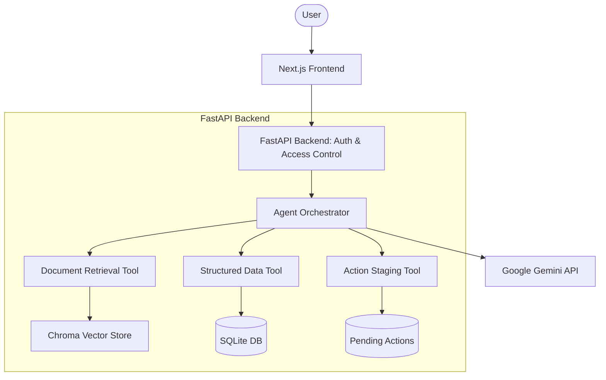

# ParcelPilot AI Support Agent

An AI support system for **ParcelPilot**, a B2B logistics platform. This project solves the challenge of delivering accurate, context-aware support by combining a natural-language AI agent with authoritative document retrieval and strict access control. 

It provides two distinct contexts over a single backend:
1. **Customer-Facing Support Agent**: Allows customers to securely ask questions about their own orders, entitlements, contracts, and support SLAs. Escalate to humans when confidence is low.
2. **Internal Support/Operations Agent**: Empowers authorized ParcelPilot staff to investigate issues across accounts, take audited actions, and proactively monitor operational health via the Model Insights dashboard.

## Live Application

- **Frontend**: https://parcelpilot-frontend.vercel.app
- **Backend API**: https://parcelpilot-agent-api.onrender.com

## Demo

[Placeholder: Link to Demo Video]

## Problem

ParcelPilot support faces several complex challenges:
- **Multiple Document Sources**: Navigating product guides, SOPs, and customer-specific agreements.
- **Policies Changing Over Time**: Differentiating between current policies and deprecated historical rules.
- **Overrides**: Customer-specific agreements often override general policy.
- **Historical Tickets**: Past tickets provide context but are unreliable as absolute policy truths.
- **Structured Data**: Support requires real-time lookup of operational data (orders, SLAs, credits).
- **Access Control**: Strict account-level data isolation is mandatory.
- **Proactive Detection**: Reactive support is insufficient; there is a need to proactively identify operational anomalies (e.g., SLA risks, systemic delays) before customers complain.

## Solution Overview

The application addresses these challenges through a strictly governed AI orchestration layer. 

- **Frontend**: A Next.js application providing a chat interface and an internal Insights dashboard.
- **API/Backend**: A Python FastAPI backend handling authentication, data retrieval, and agent orchestration.
- **Authentication & Access Control**: Role-based access control (RBAC) enforced at the data and tool layer, ensuring the LLM cannot access unauthorized data.
- **AI Agent Orchestration**: A loop driven by Google Gemini 2.5 Flash, equipped with tools for document retrieval, structured data lookup, and state-changing actions.
- **Document Retrieval**: Vector search over ingested policies and contracts, featuring a strict source authority ranking.
- **Structured Data**: SQLite database for deterministic calculations of fees, credits, and SLAs.
- **Confirmation Layer**: State-changing actions are staged and require explicit user confirmation.
- **Model Insights**: A proactive issue detection dashboard identifying SLA risks and cross-account patterns.

## Architecture



### Request Flow
1. The user submits a request via the Next.js frontend.
2. The FastAPI backend authenticates the user and establishes their role (customer or internal).
3. The Agent Orchestrator receives the prompt and passes it to the Gemini API alongside available tools and strict system instructions.
4. If tools are needed, Gemini requests execution. The orchestrator intercepts this, applies the caller's access scope, and executes the tool.
5. Tool results (e.g., retrieved documents, structured data) are returned to Gemini.
6. Gemini synthesizes the final response, which the orchestrator delivers back to the frontend.

## Agent Design

The agent operates in a multi-step orchestration loop. When a user sends a request:
- The orchestrator builds the context window and invokes Gemini.
- Gemini decides whether to answer directly or use tools. 
- The orchestrator executes requested tools locally under the user's access scope and feeds the results back to the model.
- This loop continues until Gemini produces a final text response (up to a maximum of 6 tool rounds to prevent infinite loops).
- If the agent cannot find supporting sources, or if governing terms require human judgment, it explicitly escalates the issue.
- Gemini is the sole LLM provider, configured via the `google-genai` SDK.

## Tool Design

Tools are strictly scoped by the caller's identity at execution time.

| Tool | Purpose | Data Source | Access Control | Example Use |
|---|---|---|---|---|
| `search_documents` | Retrieve policies, SOPs, and contracts. | Chroma DB (Vector) | Customer limited to own agreement + general docs. | Looking up cancellation fees for a specific account. |
| `data_lookup` | Query structured data (orders, tickets) and calculate SLAs/credits. | SQLite | Customer limited to own orders/tickets. | Checking late delivery credit eligibility. |
| `stage_action` | Stage state-changing actions (update ticket, escalate). | SQLite | Customer limited to own tickets. | Escalating an overdue ticket. |

## Multi-Step Reasoning

**Example Request:** "Can Northstar cancel ORD-1001 without a cancellation fee?"

1. **Identify User**: The system authenticates the user as Northstar (Customer).
2. **Data Lookup**: The agent uses `data_lookup` to retrieve `ORD-1001`. The access layer confirms Northstar owns this order.
3. **Data Lookup (Calculation)**: The agent uses `data_lookup` for `cancellation_fee`. The backend deterministically calculates the fee based on the order's state.
4. **Document Retrieval**: The agent uses `search_documents` to find the Northstar customer agreement and general cancellation policy to explain the reasoning.
5. **Conflict Resolution**: The system surfaces the Northstar agreement as higher authority than the general policy.
6. **Final Response**: The agent synthesizes the deterministically calculated fee with the cited policy terms.

## Trust, Reliability and Source Authority

To prevent hallucinations and policy conflicts, the system enforces a strict **Source Authority** hierarchy during retrieval:

1. Customer-specific agreement (Highest)
2. Current policy / SOP
3. Product documentation
4. Deprecated historical policy (Lowest, excluded by default)

Historical tickets are available via structured lookup for context, but the agent is instructed never to cite them as authoritative policy. When conflicts arise (e.g., a customer agreement overrides a general policy), the retrieval tool flags the conflict, and the frontend displays a warning banner. If the agent is uncertain, it is programmed to escalate to human review.

## Access Control and Data Privacy

Security is enforced in the data and tool layer, never relying solely on LLM instructions.
- **Authentication**: JWT-based session tokens securely identify the caller.
- **Role-Based Scope**: Every tool call passes a `Caller` object. 
- **Data Isolation**: If Customer A (e.g., Lumenworks) attempts to query Customer B's (Northstar) order, the backend `access.py` layer intercepts the SQL query and returns a `PermissionError` before the LLM even sees the data.
- **Internal Access**: Staff accounts bypass account-level filters but are still audited.

## Confirmation Before Actions

State-changing actions follow a safe, two-step confirmation architecture:

User requests action
        ↓
Agent prepares/stages action (via `stage_action` tool)
        ↓
System displays pending action in UI
        ↓
Explicit user confirmation (via separate API route)
        ↓
Action executed

The LLM cannot directly execute an action; it can only stage a preview.

## Model Insights — Proactive Issue Detection

The system addresses the "Proactive Issue Detection" problem via an internal **Insights Dashboard** (`/insights`). 
This dashboard performs deterministic anomaly detection across the entire database (restricted to internal staff).

Signals detected:
- **SLA Risks**: Tickets approaching or breaching contractual resolution SLAs.
- **Systemic Clusters**: Recurring issues across multiple customers sharing identical keywords (e.g., "damaged packaging").
- **Service Anomalies**: Spikes in ticket volume and counts of late pickups/deliveries.
- **Financial Exposure**: Aggregate pending service credit amounts across all accounts.

## User Experience

- **Chat Interface**: Clean, responsive design with Markdown support.
- **Tool Visibility**: Real-time indicators show when the agent is searching documents or querying data.
- **Pending Actions**: Clear UI cards prompt the user to confirm or cancel staged actions.
- **Trust Indicators**: Citations and conflict warnings are surfaced visually in the chat.
- **Insights Dashboard**: Loading skeletons, metric cards, and a clear data snapshot anchor time.

## Tech Stack

| Layer | Technology |
|---|---|
| **Frontend** | Next.js (React), TypeScript, Vanilla CSS |
| **Backend** | Python 3.13, FastAPI |
| **AI** | Google GenAI SDK (Gemini 2.5 Flash) |
| **Data** | SQLite (Structured), ChromaDB (Vector) |
| **Deployment** | Vercel (Frontend), Render (Backend API) |

## Project Structure

```
parcelpilot-ai-support-agent/
├── backend/
│   ├── app/
│   │   ├── agent/       # Orchestration and LLM provider config
│   │   ├── api/         # FastAPI routes
│   │   ├── insights/    # Proactive anomaly detection logic
│   │   ├── rag/         # Document ingestion and vector retrieval
│   │   ├── tools/       # Tool definitions and deterministic calcs
│   │   └── access.py    # Strict RBAC access control layer
│   ├── tests/           # Pytest suite
│   ├── evals/           # Offline/Live scenario evaluations
│   └── requirements.txt
├── frontend/
│   ├── app/             # Next.js App Router (chat + insights)
│   ├── components/      # React components (AppShell, Chat UI)
│   └── lib/             # API client
├── docs/                # Architecture & Product notes
└── README.md
```

## Local Setup

### 1. Clone
```bash
git clone <repository-url>
cd parcelpilot-ai-support-agent
```

### 2. Backend Setup
```bash
cd backend
python -m venv .venv 
source .venv/Scripts/activate   # Windows: .venv\Scripts\activate
pip install -r requirements.txt
cp ../.env.example .env
```
Edit `backend/.env` to include your `GEMINI_API_KEY`.
```bash
# Ingest data (PDFs -> Vector, XLSX -> SQLite)
python -m app.ingestion.run 
# Start FastAPI
uvicorn app.main:app --reload
```

### 3. Frontend Setup
Open a new terminal:
```bash
cd frontend
npm install
# Configure env variables (default targets localhost:8000)
cp ../.env.example .env.local 
npm run dev
```
Visit http://localhost:3000.

## Environment Variables

| Variable | Required | Description |
|---|---|---|
| `GEMINI_API_KEY` | Yes (for live LLM) | Google Gemini API Key |
| `LLM_PROVIDER` | Optional | Set to `gemini` |
| `GEMINI_MODEL` | Optional | Defaults to `gemini-2.5-flash` |
| `AUTH_SECRET` | Yes | HMAC secret for signing login tokens |
| `NEXT_PUBLIC_API_BASE_URL`| Yes (Frontend) | URL of the backend API |

## Running Tests

### Backend Tests
```bash
cd backend
pytest
```
### Evals (Offline Scenario testing)
```bash
python evals/run_evals.py
```

## Deployment

The application is deployed using free-tier services.

1. **Backend (Render)**: Deployed via `render.yaml`. The backend cold-starts if idle. Because Render free-tier disks are ephemeral, `app/deploy_bootstrap.py` automatically re-ingests synthetic fixtures into SQLite and Chroma on boot.
2. **Frontend (Vercel)**: Deployed by connecting the GitHub repository to Vercel, setting the Root Directory to `frontend`, and configuring `NEXT_PUBLIC_API_BASE_URL` to point to the Render API URL.

## Design Decisions and Trade-offs

- **Gemini Selection**: Gemini 2.5 Flash was selected for its fast multi-step tool-calling performance and generous free-tier limits, ideal for this assessment.
- **Deterministic Logic vs. LLM Reasoning**: SLA calculations and fee determinations are strictly handled by Python/SQLite. The LLM is prohibited from doing math to eliminate calculation hallucinations.
- **Access Control Layer**: Enforcing RBAC in the data layer (rather than relying on LLM prompt instructions) ensures foolproof isolation between customer accounts.
- **Ephemeral Storage**: Due to free-tier hosting limitations, the live deployment bootstraps data on startup. This trades persistence for ease of deployment.

## Limitations

- **Free-Tier Cold Starts**: The live Render API goes to sleep after 15 minutes of inactivity, resulting in a ~50-second cold start and data bootstrap process on the first subsequent request.
- **Mock Authentication**: While the system uses real JWTs, customer accounts and passwords are hardcoded demo fixtures.
- **Data Snapshot**: The system operates on a static dataset snapshot (time-anchored) and does not update in real-time.

## What I Would Build Next

| Priority | Improvement | Why It Matters |
|---|---|---|
| P0 | Production Authentication | Integrate with Auth0 or standard SSO for real customer onboarding. |
| P0 | Persistent Storage | Migrate SQLite and local Chroma to managed databases (e.g., Postgres + pgvector) to avoid boot-time ingestion. |
| P1 | Enhanced Citation Ranking | Implement cross-encoder reranking to improve document retrieval precision. |
| P2 | Alerting Integrations | Push Model Insights anomalies directly to Slack or PagerDuty. |

## Success Metric

**Primary Metric:** "Percentage of support requests resolved accurately based on authoritative documents and deterministic data, while maintaining absolute zero cross-account data exposure."

## Assignment Coverage

| Assessment Requirement | Implementation |
|---|---|
| Natural-language chatbot | Fully Implemented (`backend/app/agent`) |
| Supplied data pack usage | Fully Implemented (Parsed via ingestion scripts) |
| Three distinct tools | Fully Implemented (Search, Lookup, Action) |
| Access control scoping | Fully Implemented (`backend/app/access.py`) |
| Explicit confirmation | Fully Implemented (Pending Action flow) |
| Multi-step requests | Fully Implemented (Orchestration Loop) |
| Proactive issue detection | Fully Implemented (`/insights` dashboard) |
| Trust/Conflict handling | Fully Implemented (Source Authority ranking) |

## Documentation

- [Architecture Note](docs/ARCHITECTURE.md)
- [Product Note](docs/PRODUCT.md)
- [AI Tool Usage](AI_USAGE.md)
