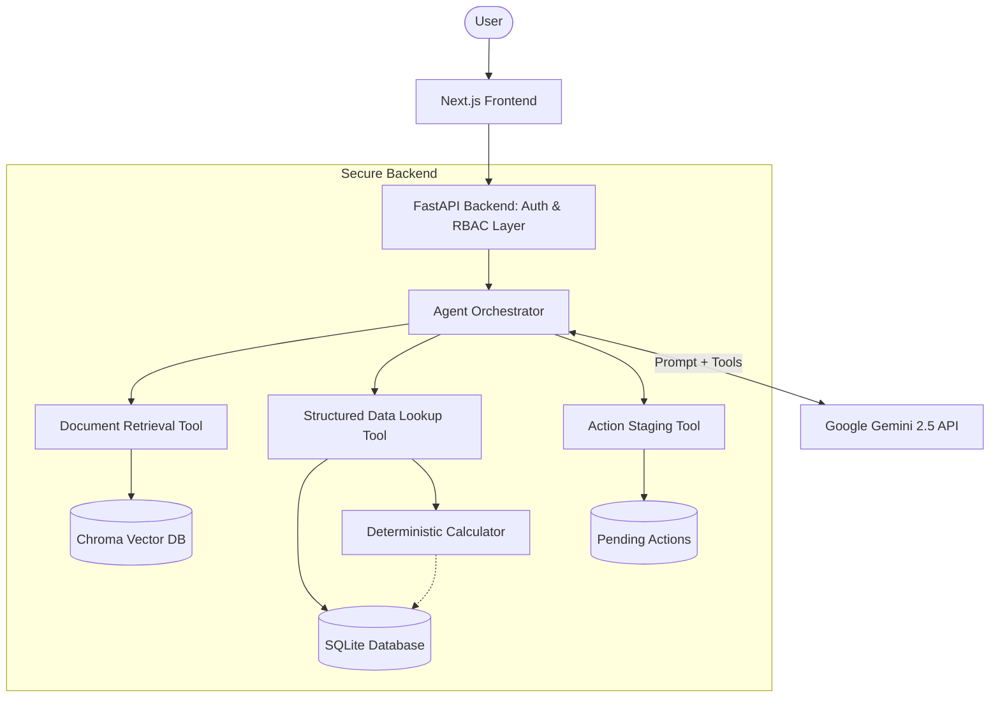

# Architecture Note

## 1. System Overview

The ParcelPilot AI Support Agent operates via a dual-layer architecture:
- A **Next.js Frontend** delivering a responsive chat interface and an internal Insights dashboard.
- A **FastAPI Python Backend** providing a secure, access-controlled orchestration layer connecting the user to Google Gemini, local vector storage, and a structured SQLite database.

By strictly separating the LLM reasoning from data access and deterministic calculations, the system prevents hallucinations related to fees, SLAs, and customer data boundaries.

## 2. Architecture Diagram

## 3. Agent Design

The Agent Orchestrator acts as an intermediary between the user, the Gemini LLM, and the system tools.

**Orchestration Flow:**
1. The user's message is wrapped in an access-scoped `Caller` object.
2. The orchestrator invokes Gemini, injecting system instructions tailored to the user's role (Customer or Staff) and available tool definitions.
3. If Gemini issues a tool call, the orchestrator intercepts it, injects the `Caller` scope, and executes the tool locally.
4. Tool results are appended to the context, and Gemini is invoked again.
5. This loop repeats (max 6 rounds) until Gemini produces a final text response.
6. If the agent hits an execution error, or if tools dictate an escalation, the orchestrator sets an `escalated` flag to true.

## 4. Tool Design

The LLM is provided three strictly defined tools:

- **`search_documents`**: Queries the Chroma vector store. Returns excerpts ranked by semantic relevance and weighted by Source Authority. It accepts a `query` string and an `include_deprecated` flag.
- **`data_lookup`**: Queries SQLite for orders, tickets, and accounts. It also triggers deterministic calculations (cancellation fees, SLAs). Accepts a `lookup_type` (e.g., `cancellation_fee`) and relevant IDs.
- **`stage_action`**: Used to prepare state-changing actions (e.g., `update_ticket`, `create_escalation`). Accepts an `action_type` and parameter payload. This tool ONLY creates a preview; it never executes the action directly.

## 5. Document Handling

- **Ingestion**: PDF documents (SOPs, Guides, Contracts) are parsed using Python scripts.
- **Chunking**: Text is split into semantically coherent chunks using a recursive character text splitter.
- **Metadata**: Every chunk receives metadata indicating its source type (`customer_agreement`, `policy`, `product_guide`), target `account_id` (if applicable), and `status` (`CURRENT` or `DEPRECATED`).
- **Retrieval**: User queries are vectorized and matched against Chroma DB.
- **Authority/Freshness**: Retrieval heavily weights `customer_agreement` over `policy`.
- **Deprecated Documents**: By default, `DEPRECATED` documents are filtered out of search results unless the LLM explicitly sets `include_deprecated=true`.

## 6. Structured Data Handling

- **Account Data**: Customers can only view their own account records.
- **Order Data**: Order status, pickup/delivery times, and shipment details are queried via the `data_lookup` tool.
- **Ticket Data**: Historical ticket resolutions are accessible to the LLM to understand past context (e.g., `similar_past_tickets` lookup) but are explicitly tagged as non-authoritative.
- **Access-Scoped Querying**: The `app.access` layer intercepts all SQL lookups, appending `WHERE account_id = ?` clauses dynamically based on the authenticated session token.

## 7. Source Reliability and Conflict Resolution

The system addresses the "Conflicting Sources" problem through a rigid **Source Authority Hierarchy**.

The ranking logic in the retrieval engine enforces:
1. **Customer Agreement**: Highest authority. Overrides general policy.
2. **SOP / Current Policy**: Standard authority.
3. **Product Guide**: Baseline authority.
4. **Historical Tickets**: Context-only, zero policy authority.

**Conflict Resolution**: When the retrieval tool finds a customer agreement that contradicts a general policy on the same topic, it explicitly returns a `conflicts` flag to the frontend, which renders a warning banner ensuring transparency.

## 8. Action Safety

State-changing actions utilize a two-step confirmation architecture to prevent LLM hallucinations from corrupting data.

1. **Staging**: The LLM calls `stage_action`. The backend generates a preview (e.g., "Pending Action: Update Ticket Priority to P1") and stores it temporarily in memory with a unique `pending_action_id`.
2. **Review**: The orchestrator returns a message to the LLM indicating the action is pending. The frontend displays a dedicated confirmation UI component.
3. **Execution**: The user must explicitly click "Confirm" in the UI. This triggers a separate, non-LLM API endpoint (`POST /api/actions/confirm`) which executes the SQL update.

## 9. Model Insights

To address "Proactive Issue Detection," the system features an internal Model Insights dashboard.
- **Architecture**: A dedicated FastAPI route (`/api/insights`) bypasses the LLM to run heavy aggregations directly against SQLite.
- **SLA Monitoring**: Deterministically checks active tickets against their contractual SLAs based on time snapshots.
- **Anomaly Clustering**: Detects volume spikes across categories and clusters shared keywords (e.g., "damaged") across multiple customers.
- **Service Quality**: Tracks real-time late pickup and late delivery counts.

## 10. Major Technical Trade-offs

- **Gemini Integration**: We migrated to Gemini 2.5 Flash for rapid multi-step reasoning. Trade-off: Bound by free-tier RPM limits.
- **Deterministic vs. LLM**: We offloaded all math (fees, SLA hours) to Python. Trade-off: Requires maintaining Python calculation logic, but guarantees 100% accuracy and eliminates LLM arithmetic hallucinations.
- **Local/Mock Components**: Due to assessment constraints, authentication uses hardcoded mock passwords, and deployment relies on ephemeral free-tier SQLite. Trade-off: Not instantly production-ready, but demonstrates the core security architecture perfectly.
- **API Quotas**: Free-tier Gemini quotas restrict concurrency. Trade-off: Evaluated scenarios may need rate-limiting logic.
- **Simplicity vs. Scalability**: We used local ChromaDB and SQLite rather than Postgres/Pinecone to ensure the reviewer could run the stack entirely locally with a single script.

## 11. Request Lifecycle

1. **Input**: User types "Cancel order ORD-1001" and clicks Send.
2. **Auth Check**: Next.js sends the request with a JWT to `/api/chat`.
3. **Context Build**: FastAPI validates the JWT, determining the caller is `ACC-001` (Northstar).
4. **LLM Invocation**: Orchestrator sends the prompt to Gemini.
5. **Tool Decision**: Gemini realizes it needs data and calls `data_lookup(order, ORD-1001)`.
6. **Scoped Execution**: The access layer verifies `ORD-1001` belongs to `ACC-001`, queries SQLite, and returns order details.
7. **Calculation**: Gemini calls `data_lookup(cancellation_fee, ORD-1001)`. Python computes the fee deterministically.
8. **Policy Check**: Gemini calls `search_documents("cancellation fee")`. Chroma returns Northstar's contract terms.
9. **Synthesis**: Gemini generates a response explaining the fee and citing the contract.
10. **Delivery**: The response, along with tool trace data and citations, is rendered on the frontend.
